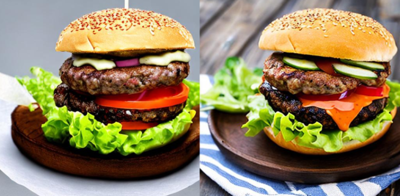
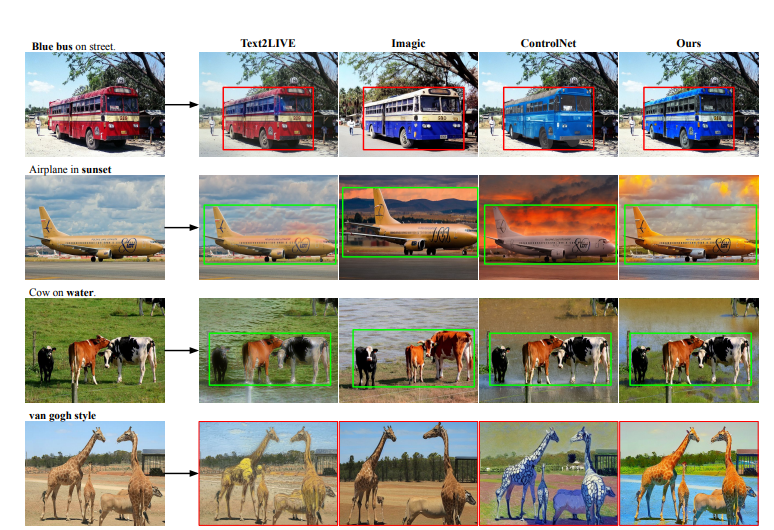
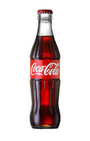

# Product-Scene-Designing

## Project for making product  background scene designing  or product placement algorithms

<br>
This project shows cases of the usage of models like Dreambooth and stable diffusion for the creation of background scenes creation and product placement image creation   <br>
<br> <p  align = "center" >     ></p>
<br>

## Documentation  

There are several models one can easily make use of to execute image creation. Here I am showcasing several models to output our result, 

<br>
Stable diffusion: A variation of the diffusion process, which is a probabilistic model used in statistical physics to explain how particles behave in a fluid, is called stable diffusion. Stable Diffusion is a term used to describe a technique in generative AI that progressively creates a picture from a noise source. A series of progressively more intricate convolutional neural networks (CNNs) process the noisy information, producing progressively better images with each network. This procedure is repeated until a high-quality image that resembles the initial training data is produced as the end result.<br>
<br>
<br>
<br>
The three key ingredients for convincing and sufficiently varied images are:
<br>

* Object Transform and Color Augmentations: creates more variation of the object to widen the variety of environments and scenarios it can be placed in. <br>
* Background In-Painting: creates environmental variation in the background.<br>
* Object In-Painting: fills in the background completely for a smoother transition between foreground and background.<br>
<br>
Stable Diffusion In-Painting<br><br>
Stable Diffusion's initial goal was to create fresh images out of random noise. On the other hand, in-painting is a modification that has been garnering interest. Traditionally, it has been applied to computer vision tasks to repair or fill in damaged or missing areas of images. It entails automatically adding realistic content to the blank spaces in an image so that the filled-in portions seem visually smooth and cohesive with the surrounding areas. We can instruct Stable Diffusion to alter only the masked portions of a picture by repeatedly re-noising and then denoising them in response to a textual prompt by masking certain areas of the image.
<br>
Two-Stage Background In-Painting<br>

We can use object in-painting as a second step to create a flawless background in order to get past this problem. Next, we place the object on top of the spotless background that has been separated from the original image using the binary mask.<br>

Color Enhancement Using InstructPix2Pix<br>
We can change additional parts of the item with InstructPix2Pix to add even more diversity. InstructPix2Pix is a conditional diffusion technique that combines the capabilities of GPT-3 and stable diffusion to alter photos from human instructions. Since it is currently insufficiently robust to make significant changes to photos without losing semantic information, we will only use the example of changing an object's colour.<br>
#####
Above I have shown one implementation with the help of Datature Nexus using their annotations and the second one is completely a dreambooth implementation using the runwayml/stable-diffusion-v1-5. Another dreambooth implementation can be done by the auto-train dreambooth using the model stable- diffusion xl - base 10 (try it out urself). 
<br> 
There is also some inspiration taken from this documentation on <a href="https://arxiv.org/pdf/2305.17489.pdf">Text-to-image Editing by Image Information Removal </a> 
<br>
<table>
  
<tr>
   <td align="center">Output with prompts </td>
   <td align="center">input</td> 
</tr>
 
<tr>
 <td height="250" width="280" align="center"><div align=center></td>
 <td rowspan="2" align="center" width="550" height="550"></td>
</tr>
<tr height="250">
  <td align="center" width="280"><div align=center><div align=center></td> 
</tr>

</table><p>
 
</p>
<br>
### Try out my project at  and <br>


```
git clone https://github.com/deveshruttala/product-scene-designing.git
```

 The installation and usage documents are self-explanatory  

<p>
 >
</p>


## Conclusion and credits

<br>
By the usage of these models, there are several applications and image creation that can be done rather than creating a background scene for a product. The scope of the models being vast the image applications can also be boosted for example we can train the model and ask it to output images for books or create advertisements etc. <br>

I wanna give a special thanks to <a href="https://developers.datature.io/docs/introduction-to-datature">datature</a> and dreambooth model implementors for providing me access to use their models. 
<br>
In the evolving ai age there are several apps that can implement this function like dall e, midjourney, pebbeley, breeze etc , try those softwares out and feel free to pull request me some newer models on this application 
<br>
Happy innovation 
<br>

